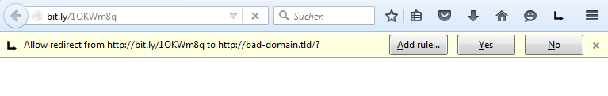

# Redirect Control
by [hjgwmvya](https://github.com/hjgwmvya)

## Summery

This add-on enables you to allow or deny redirects from web pages.

## Screenshot

## Description

Redirect Control is a security add-on that enables you to allow or deny redirects from web pages. It displays the origin and destination of a request and lets you decide whether to perform the request or not.

Following requests are allowed by default:

 * If origin and destination of the request have the same base domain (e.g. abc.domain.tld -> xyz.domain.tld, can be disabled)
 * Requests triggered by a link click (can be disabled)
 * Requests matching user-defined rules

Following patterns are possible for user-defined rules to allow requests by default:

 * domainABC.tld -> domainXYZ.tld
 * domain.tld -> (to any domain)
 * (from any domain) -> domain.tld
 * abc.domain.tld -> xyz.domain.tld (rules for specfic subdomains, optional)
 * \*.domainABC.tld -> \*.domainABC.tld (wildcards supported)
 * ^(.\*\\.)?mozilla\.(com|org)$ ->	^(.\*\\.)?mozilla\.(com|org)$ (regular expressions supported, optional)
 
## License

[GPL-3.0](http://www.gnu.org/licenses/gpl-3.0-standalone.html)
